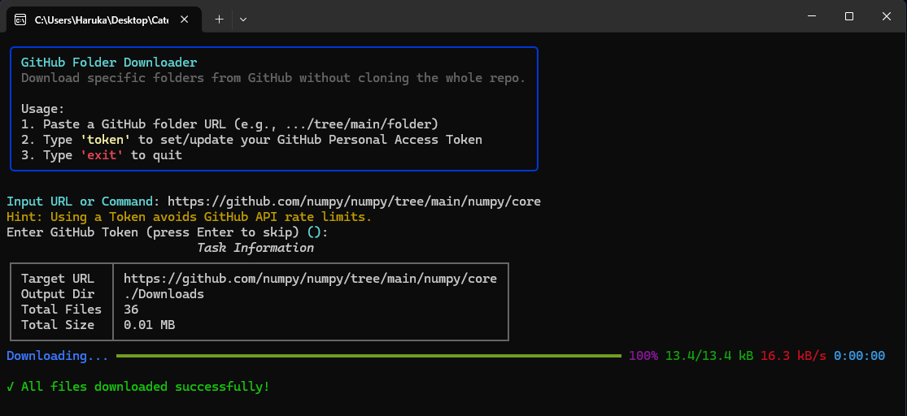

# GitHub Folder Downloader

A high-performance CLI tool to download specific folders from GitHub repositories recursively without cloning the entire
repository.



## 🚀 Download

[**Get the Latest Release**](https://github.com/your-username/your-repo/releases)

## 🛠️ How to Use

### Basic (Interactive Mode)

Simply run the program and follow the prompts:

- **Windows:** Double-click `GithubDownloader.exe`

### Advanced (CLI Mode)

You can also run it via **PowerShell** or **CMD** for automation:

```powershell
# Basic usage
.\GithubDownloader.exe "https://github.com/user/repo/tree/main/folder"

# Specify output directory and thread count
.\GithubDownloader.exe "URL" --output "./MyFolder" --workers 15

# Use a Personal Access Token to avoid API limits
.\GithubDownloader.exe "URL" --token "your_github_token"